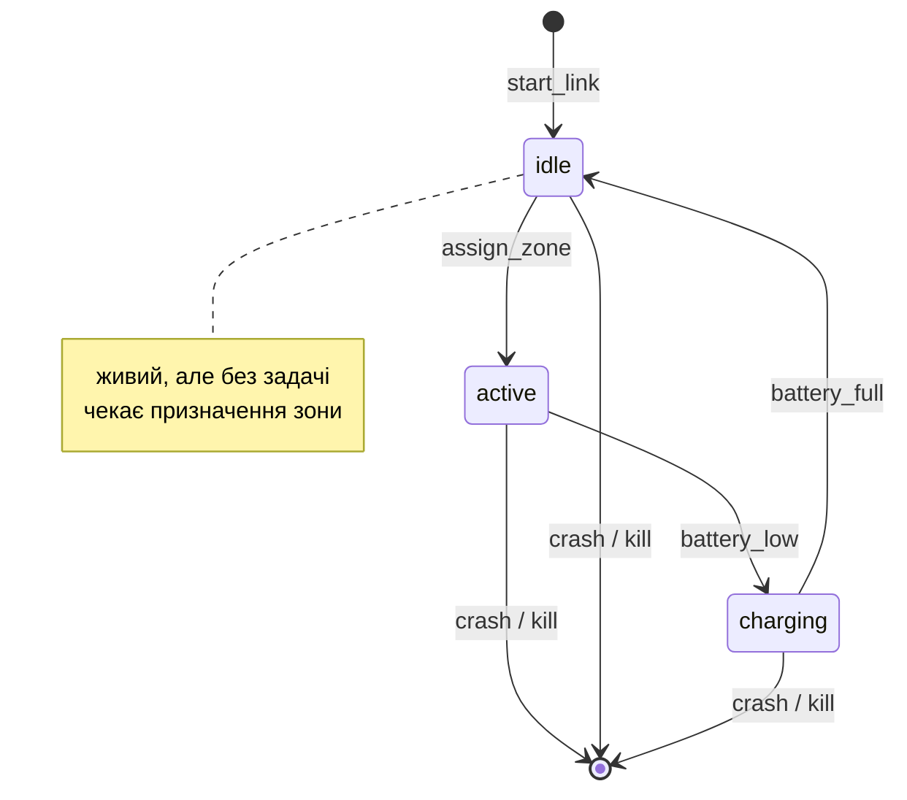

# Autonomous Drone Swarm Coordinator

**Erlang/OTP pet-проєкт для портфоліо**
Період: 3 тижні · Бюджет: 2–3 год/день (~35–50 год загалом)
Статус: 🟡 Тиждень 1 — не розпочато

---

## 1. Опис проєкту

Симуляція рою автономних дронів на Erlang/OTP. Кожен дрон — незалежний процес
(`gen_statem`) зі своїм життєвим циклом станів: позиція `{x, y}`, рівень батареї,
призначена зона, статус. Окремий процес-**координатор** ділить карту на зони й
розподіляє їх між дронами.

**Ключова ідея — self-healing на двох рівнях одночасно:**

| Рівень | Що відбувається при збої |
|---|---|
| **Процес** | Дрон крашиться → `supervisor` автоматично рестартує новий процес |
| **Логічна задача** | `coordinator` через `monitor` помічає смерть → перерозподіляє зону на живі дрони |

Це і є основна цінність проєкту: не «сервіс, який використовує supervision»,
а наочна демонстрація того, як OTP-механіки (`supervisor`, `monitor`, `let it crash`)
працюють разом у реальній системі.

**Демо:** 2D-карта в браузері (WebSocket) — видно рух дронів наживо
і перефарбування зон у момент збою та відновлення.

### Сильні сторони Erlang, які показує проєкт

- ✅ **fault-tolerant** — рестарт процесів + перерозподіл задач
- ✅ **distributed** — (бонус, тиждень 3) дрони на різних нодах
- ✅ **scalable** — легко підняти 10 або 500 дронів
- ✅ **high-load** — сотні одночасних процесів з таймерами
- ✅ **real-time** — позиції оновлюються наживо через WebSocket

---

## 2. Технічний стек

| Компонент | Вибір | Обґрунтування |
|---|---|---|
| Build tool | **rebar3** | De-facto стандарт спільноти, Hex-екосистема |
| Дрон | **gen_statem** | Явний життєвий цикл станів (нова для мене behavior) |
| Координатор | `gen_server` | Просто тримає мапу зон і призначень |
| Нагляд | `supervisor` (`simple_one_for_one`) | Динамічний спавн N дронів |
| Web-шар | **Cowboy** + WebSocket | Чистий Erlang, без Elixir-залежностей |
| Frontend | Простий HTML + JS (Canvas/SVG) | Мінімум, аби бачити карту |
| Юніт-тести | **EUnit** | Логіка переходів, розрахунок зон |
| Інтеграційні | **Common Test** | Сценарії self-healing, підняття всього дерева |
| Контейнеризація | **Docker** + docker-compose | Запуск однією командою |

---

## 3. Архітектура

### Supervision tree

```
drone_swarm_sup                     (top-level, one_for_one)
│
├── drone_swarm_coordinator         (gen_server)
│     └─ тримає мапу: зона → worker_pid
│     └─ monitor'ить усіх воркерів
│
├── drone_swarm_workers_sup         (simple_one_for_one)
│     ├── drone_swarm_worker_1  (gen_statem)
│     ├── drone_swarm_worker_2  (gen_statem)
│     ├── drone_swarm_worker_3  (gen_statem)
│     └── ...                   (динамічно N штук)
│
├── drone_swarm_chaos_monkey        (gen_server)
│     └─ періодично вбиває випадкового воркера
│
└── drone_swarm_web_sup             (Cowboy listener + WS handler)
```

### Життєвий цикл дрона (gen_statem)



| Стан | Значення |
|---|---|
| `idle` | Живий, працездатний, без задачі. Стартовий стан (і після рестарту) |
| `active` | Виконує задачу — патрулює призначену зону, рухається, витрачає батарею |
| `charging` | Батарея нижче порогу, дрон "заряджається", задачу тимчасово не виконує |
| *(dead)* | Не окремий стан — процес просто падає, це і є "let it crash" |

> **Примітка про `dead`:** спочатку планувався як стан, але ідіоматично в Erlang
> мертвий дрон — це мертвий процес, а не процес у стані "мертвий". Supervisor
> підніме новий. Це саме та деталь, яку варто пояснити на інтерв'ю.

### Потік даних при збої

```
1. drone_swarm_chaos_monkey → exit(worker_3, kill)
2. drone_swarm_workers_sup  → помічає падіння → рестартує worker_3' (новий pid, стан idle)
3. drone_swarm_coordinator  → отримує 'DOWN' від monitor → зона Z3 стає безхазяйною
4. drone_swarm_coordinator  → перепризначає Z3 на worker_1 (тимчасово 2 зони)
5. worker_3'                → реєструється у coordinator → отримує Z3 назад
6. WebSocket                → пушить оновлення на карту на кожному з кроків
```

---

## 4. План по тижнях

**Легенда:** ⬜ не розпочато · 🟡 в роботі · ✅ зроблено · ❌ вирізано зі скоупу

### Тиждень 1 — Дрон + Supervisor
*Мета: N дронів живуть під наглядом, мають реальний життєвий цикл станів*

| День | Задача | Статус |
|---|---|---|
| 1 | Setup: `rebar3 new app drone_swarm`, git init, структура папок | ⬜ |
| 1 | Мінімальний `gen_statem`: `init/1`, `callback_mode/0`, один стан `idle` | ⬜ |
| 2 | Стани `active` / `charging` + переходи за таймером (батарея) | ⬜ |
| 2 | EUnit-тести на переходи станів | ⬜ |
| 3 | `drone_swarm_workers_sup` (`simple_one_for_one`) + `spawn_worker/1` | ⬜ |
| 3 | `drone_swarm_sup` — top-level supervisor | ⬜ |
| 4 | Базовий рух: оновлення `{x, y}` раз/сек у стані `active` | ⬜ |
| 4 | Логування стану дронів у консоль | ⬜ |
| 5 | `drone_swarm_chaos_monkey`: періодичний `exit(Pid, kill)` випадкового воркера | ⬜ |
| 5 | Перевірка: supervisor рестартує, новий дрон в `idle` | ⬜ |
| 6–7 | **Буфер:** чистка коду, тести, README-checkpoint | ⬜ |

**Checkpoint тижня 1:** `rebar3 shell` → піднімається N дронів → drone_swarm_chaos_monkey вбиває
одного → в логах видно рестарт. EUnit проходить.

---

### Тиждень 2 — Coordinator + Self-healing
*Мета: перерозподіл зон при падінні дрона працює наживо*

| День | Задача | Статус |
|---|---|---|
| 8 | `drone_swarm_coordinator` (gen_server): структура зон, розбиття карти на сітку | ⬜ |
| 8 | EUnit на логіку розбиття зон | ⬜ |
| 9 | Реєстрація дрона в координаторі при старті, призначення зони | ⬜ |
| 9 | Дрон переходить `idle → active` при отриманні зони | ⬜ |
| 10 | `monitor` дронів у координаторі, обробка `'DOWN'` | ⬜ |
| 10 | Логіка перерозподілу: зона мертвого → на живі дрони | ⬜ |
| 11 | Повернення зони новому дрону після рестарту (rebalance) | ⬜ |
| 12 | **Common Test:** сценарій «вбий дрон → перевір перерозподіл → перевір повернення» | ⬜ |
| 12 | Common Test: сценарій «вбий координатора → дрони живі» | ⬜ |
| 13–14 | **Буфер:** обробка edge-cases (усі дрони мертві, зон більше ніж дронів) | ⬜ |

**Checkpoint тижня 2:** Common Test проходить сценарій self-healing end-to-end.
У логах чітко видно ланцюжок: kill → restart → reassign → rebalance.

---

### Тиждень 3 — Візуалізація + Поліш
*Мета: портфоліо-готовий проєкт з живим демо*

| День | Задача | Статус |
|---|---|---|
| 15 | Cowboy: HTTP-сервер + статика (index.html) | ⬜ |
| 15 | WebSocket handler: підписка на оновлення стану | ⬜ |
| 16 | Broadcast стану рою (позиції + зони) раз на N мс | ⬜ |
| 17 | Frontend: карта на Canvas/SVG, крапки-дрони, кольорові зони | ⬜ |
| 17 | Візуальний фідбек збою (дрон блимає/зникає, зона перефарбовується) | ⬜ |
| 18 | `Dockerfile` + `docker-compose.yml` | ⬜ |
| 19 | **README:** опис, архітектура, діаграми, як запустити, design decisions | ⬜ |
| 19 | GIF/скріншот демо для README | ⬜ |
| 20 | Бенчмарк: 100/500 дронів — CPU, memory, latency оновлень | ⬜ |
| 21 | **Буфер / бонус:** distributed-режим (дрони на 2+ нодах) | ⬜ |

**Checkpoint тижня 3:** `docker-compose up` → відкриваєш браузер → бачиш живу карту
з дронами → drone_swarm_chaos_monkey вбиває воркера → на очах відбувається перерозподіл.

---

## 5. Скоуп: що НЕ входить

Свідомо вирізано, щоб гарантовано дійти до полішу. Якщо тисне час — ріжеться далі
згори вниз списку «пріоритет вирізання» в плані (тиждень 3 → distributed → бенчмарки).

- ❌ Реальна фізика польоту, колізії між дронами
- ❌ Pathfinding / оптимальні маршрути (досить випадкового блукання в межах зони)
- ❌ Реалістична модель розряду батареї (досить простого таймера)
- ❌ Персистенція стану (Mnesia/диск) — рій ефемерний за дизайном
- ❌ Автентифікація, багатокористувацький доступ до UI
- ❌ Реальний зв'язок із залізом (це симуляція, і це чесно зазначено в README)

---

## 6. Interview talking points

*Заготовки для розповіді про проєкт на співбесіді. Наповнювати по мірі роботи.*

- **Чому `gen_statem`, а не `gen_server`?** Дрон має чіткий життєвий цикл станів
  із різною поведінкою в кожному, а не просто мутуючі дані. `gen_statem` робить
  переходи явними й не дає «забути» обробити подію в певному стані.
- **Чому мертвий дрон — це не стан `dead`?** Бо ідіоматичний Erlang — це «let it crash»:
  мертвий процес, а не процес, що знає про свою смерть. Supervisor підніме новий.
- **Monitor vs Link — де і чому?** Дрони під supervisor через link (частина дерева нагляду).
  Координатор — через `monitor`, бо йому треба *знати* про смерть, але не *вмирати* разом.
- **Чому `simple_one_for_one` для дронів?** Однотипні динамічні children, кількість
  невідома на етапі старту.
- **Чому drone_swarm_coordinator і drone_swarm_workers_sup — сиблінги?** Щоб падіння координатора не вбивало рій.
- *(додати після бенчмарків)* — цифри: скільки дронів тримає, скільки пам'яті на процес
- *(додати після тижня 2)* — які edge-cases виявились найважчими

---

## 6.1 План модулів (design, до коду)

### drone_swarm_coordinator
Головна ідея: зв'язати всі зони з дронами, не може бути пустих (`unassigned_zones`) зон.
- Задачі (зони): заасайнені / незаасайнені (`unassigned_zones`)
- Воркери (дрони): вільні / зайняті
- Мапа: `#{drone_pid :: pid() => [zone_id :: integer()]}`

1. **Init** — формує рекорд стану
2. **Отримає новий дрон** → ставить `monitor` → перевіряє `unassigned_zones`
   - є вільні зони → віддає дрону всі вільні зони
   - немає вільних → забирає `max_zones_per_drone` зон у найзавантаженішого
     дрона (**MVP: rebalancing-при-приєднанні поки не реалізуємо** — це
     бонус-фіча після базового self-healing; `max_zones_per_drone` фіксуємо
     в конфігу зараз, використання відкладаємо)
3. **Отримає `battery_low`** від дрона → переасайнює **всі** зони цього дрона →
   надсилає повідомлення **лише тим дронам, які отримали нові зони**
4. **Отримає `'DOWN'`** від monitor → те саме, що п.3 (переасайнює всі зони,
   цільові повідомлення)
5. **Втрата зв'язку** (опційно, окремо подумати пізніше)

### drone_swarm_workers_sup
1. Init — запускає пул дронів, віддає pid-и до `chaos_monkey`
2. Дрон крашиться → supervisor автоматично рестартує → віддає новий pid до
   `chaos_monkey`

> Elegance-момент: новий дрон і рестартований дрон проходять **той самий шлях
> реєстрації** через `init` → coordinator. Coordinator і supervisor не знають
> і не мають знати різниці між "новий" і "відновлений" дрон — це і є суть
> "let it crash". Гарний talking point для інтерв'ю.

### drone_swarm_worker (gen_statem, state = idle/active/charging)
1. **Init** → статус `idle` → реєструється в coordinator → **без таймера на
   `battery_low`** (рішення: idle не витрачає заряд — дрон без задачі не
   патрулює, тож немає чого розряджати)
2. **Отримає зони від coordinator** → статус `active` → ставить таймер
   `battery_low` (15 сек) → рухається по зоні (тригер руху — окремий
   таймер-тік, деталі TBD)
3. **Self-msg `battery_low`** → повідомляє coordinator → таймер на зарядку →
   статус `charging` → таймер на перехід в `idle`
4. **Self-msg `idle`** (після зарядки) → статус `idle` → реєструється в
   coordinator знову → таймер на `battery_low`

### drone_swarm_chaos_monkey
- Отримує актуальний список живих pid-ів дронів через
  `supervisor:which_children/1` (окремий `monitor` тут не потрібен — monitor
  для self-healing уже ставить `coordinator`, дублювати відповідальність зайве)
- Періодично (5–15 сек) вбиває випадкового живого воркера

---

## 6.2 Відкриті питання / TODO перед кодом

- [ ] Rebalancing-при-приєднанні (steal `max_zones_per_drone` from
      most-loaded drone) — відкласти як бонус-фічу після MVP
- [ ] Тригер руху дрона по зоні (окремий таймер-тік?) — деталі не визначені
- [ ] П.5 координатора (втрата зв'язку) — відкладено, подумати окремо

---

## 7. Журнал прогресу

*Короткі записи наприкінці кожного дня: що зроблено, де застрягла, що зрозуміла.*

| Дата | Що зроблено | Нотатки / складнощі |
|---|---|---|
| | | |

---

## 8. Рішення по проєкту

- [x] Кількість дронів за замовчуванням: **5** (налаштовується)
- [x] Карта: два незалежні параметри — **розмір блоку** (`block_size`, напр. `{20, 40}`)
      і **кількість блоків** (`grid_dim`, напр. `{4, 3}`). Загальна карта =
      добуток: `80×120`. Дефолт для 5 дронів: `block_size = {30, 30}`,
      `grid_dim = {3, 3}` → карта 90×90, 9 зон (навмисно більше зон, ніж дронів,
      щоб перерозподіл при збої був наочним). Для тесту на 400 дронів — збільшити
      лише `grid_dim` (наприклад `{20, 20}`), лишивши `block_size` тим самим:
      так змінюється саме навантаження, а не територія на дрон.
- [x] Chaos monkey: вбиває випадковий дрон раз на **5–15 сек** (рандомізовано)
- [x] Назва репозиторію: **`drone_swarm`** — коротко, чисто читається як OTP app
      (`drone_swarm_sup`, `drone_swarm_coordinator`...). Альтернатива, якщо захочеться
      сильніше підкреслити fault-tolerance в назві: `resilient_swarm`
